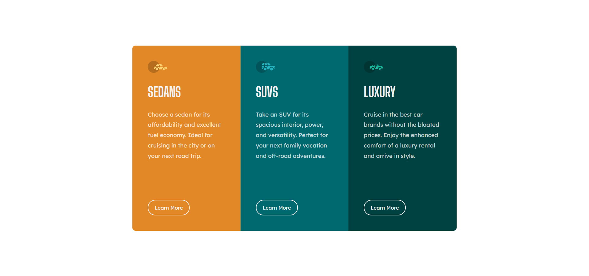

# Frontend Mentor - 3-column preview card component solution

This is a solution to the [3-column preview card component challenge on Frontend Mentor](https://www.frontendmentor.io/challenges/3column-preview-card-component-pH92eAR2-). Frontend Mentor challenges help you improve your coding skills by building realistic projects. 

## Table of contents

- [Frontend Mentor - 3-column preview card component solution](#frontend-mentor---3-column-preview-card-component-solution)
  - [Table of contents](#table-of-contents)
  - [Overview](#overview)
    - [The challenge](#the-challenge)
    - [Screenshot](#screenshot)
    - [Links](#links)
  - [My process](#my-process)
    - [Built with](#built-with)
    - [What I learned](#what-i-learned)
    - [Continued development](#continued-development)
    - [Useful resources](#useful-resources)
  - [Author](#author)

## Overview

### The challenge

Users should be able to:

- View the optimal layout depending on their device's screen size
- See hover states for interactive elements

### Screenshot

Desktop version 

Mobile version 

### Links

- Solution URL for html: [Solution HTML](https://github.com/hadysane/3-column-preview-card-component-main/blob/8c99de7fb418d25a7799f26da74d4d34a32142d9/index.html)

- Solution URL for css : [Solution css](https://github.com/hadysane/3-column-preview-card-component-main/blob/8c99de7fb418d25a7799f26da74d4d34a32142d9/css/style.css)
  
- Live Site URL: [Add live site URL here](https://3-column-preview-card-component-main-inky.vercel.app/)

## My process

### Built with

- Semantic HTML5 markup
- CSS custom properties
- Flexbox
- CSS Grid
- Mobile-first workflow

### What I learned

I learn use to CSS grid basic because I want know use. I use the proprety "grid-template-columns", " column-gap" and other...

### Continued development

Now, I learn to bulding landing page web site

### Useful resources

- [A Complete Guide to Grid](https://css-tricks.com/snippets/css/complete-guide-grid/) - Learn to use CSS Grid
- 

## Author

- Frontend Mentor - [@hadysane](https://www.frontendmentor.io/profile/hadysane)
- Twitter - [@HadySane](https://twitter.com/HadySane)

